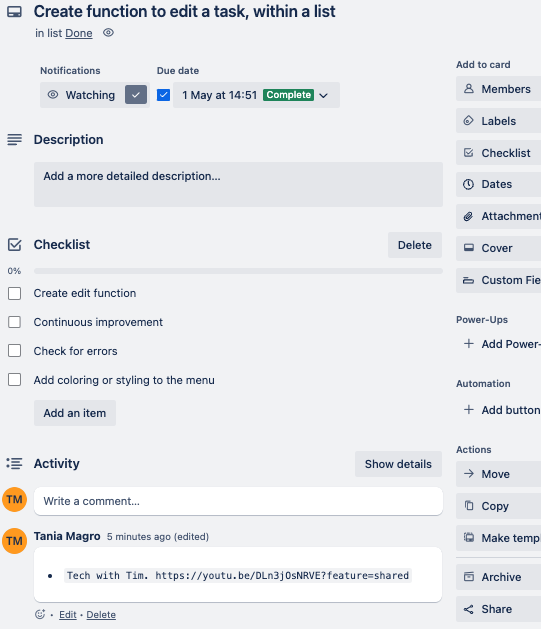

# TaniaMagro_T1A3: Terminal Application

#### Source Control Repository: 
Git SSH URL: git@github.com:TaniaDeveloper/TaniaMagro_T1A3.git

#### Identify code style guide:
I utilised the PEP 8 style guide while developing my Terminal Application: Task List. Some features of PEP8 include:
* Imports: Ensuring they adherded to the guidelines eg. import os
* Whitespace: Not adding whitespace, where it is not required
* Comments: Ensuring comments are provided with enough detail, advising what each section is about
* Line Length: Keeping to the required 79 characters per line

## Terminal Application

### Instructions to Access the Terminal Application
For instructions on how to access the terminal and the Help of FAQs please click the link for the Help Documentation.

[Help Documentation:](./docs/Instructions_and_help.md)

### How to use 💻 Plan Your Life | Task List 💻

For a full description of each feature within the terminal, click the link.

## Project Plan

I utilised Trello and created a kanban board, and listed all the items that I needed to complete.

**Working on tasks**

I had deadlines for action items, and created a checklist for grouped tasks. I also included brainstorm ideas or links to videos that I watched for reasrech purposes.

Terminal Application Ideas

Checklist of grouped items

**Testing the terminal for each menu selection**

I also had progressed with completing some of the tasks, that were on my action board. I had utilised placing dates for when certain items were due to be completed, however not all tasks were completed within the alloted time frame.

**All tasks completed**

All tasks have now been completed for the terminal application.

I enjoyed using Trello, within the environment I have created. Have previously used Jira within my organisation however now utilise Microsoft Project (Web), which is moving into Planner. Each of the systems have their strengths and weakneses, and it has been great to be able to use different sytems for different context.

## References
Python Software Foundation. 01 August 2013. PEP 8 -- Style Guide for Python Code. Retrieved from https://peps.python.org/pep-0008/

Python Software Foundation. venv - Creation of virtual environments Retrieved from https://docs.python.org/3/library/venv.html

Tech with Tim. 11 June 2021. 5 Mini Python Projects - For Beginners. Available at: https://youtu.be/DLn3jOsNRVE?feature=shared

Python Package Index. 20 December 2023. Colored 2.2.4. Available at: https://pypi.org/project/colored/

