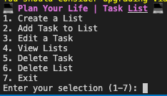

# TaniaMagro_T1A3: Terminal Application

#### Source Control Repository: 
Git SSH URL: git@github.com:TaniaDeveloper/TaniaMagro_T1A3.git

#### Identify code style guide:
I utilised the PEP 8 style guide while developing my Terminal Application: Task List. Some features of PEP8 include:
* Imports: Ensuring they adherded to the guidelines eg. import os
* Whitespace: Not adding whitespace, where it is not required
* Comments: Ensuring comments are provided with enough detail, advising what each section is about
* Line Length: Keeping to the required 79 characters per line

## Terminal Application

### Develop a list of features that will be included in the application

There are seven options to select from the Task List menu:

**1. Create a List**

## Project Plan

### Instructions to Access the Terminal Application
#### System Requirements:
* Python3 needs to be installed. Version 3.9.6 or higher is required
* .venv will also be required 

Follow the the instructions below to install the Task List Terminal Application:

1. Clone the Git repository (only select one option:)
    1. SSH: git clone git@github.com:TaniaDeveloper/TaniaMagro_T1A3.git
    2. HTTPS: https://github.com/TaniaDeveloper/TaniaMagro_T1A3.git
2. cd TaniaMagro_T1A3
3. cd src
4. chmod +x run.sh
5. ./run.sh

### How to use 💻 Plan Your Life | Task List 💻

Yu can

## References
Python Software Foundation. 01 August 2013. PEP 8 -- Style Guide for Python Code. Retrieved from https://peps.python.org/pep-0008/

Python Software Foundation. venv - Creation of virtual environments Retrieved from https://docs.python.org/3/library/venv.html

Tech with Tim. 11 June 2021. 5 Mini Python Projects - For Beginners. Available at: https://youtu.be/DLn3jOsNRVE?feature=shared

Python Package Index. 20 December 2023. Colored 2.2.4. Available at: https://pypi.org/project/colored/

